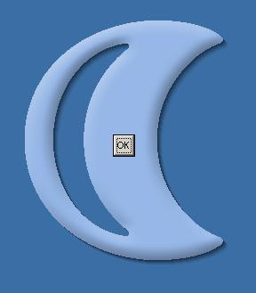



## Tranparency 3 \(1\+2\)

### Description

Part III of my API Approch... Drop Shadow + Custom Size Form
 
### More Info
 

             |
---                |---
**Submitted On**   |2005-12-03 02:28:04
**By**             |[M\. M\. Rifat\-Un\-Nabi](https://github.com/Planet-Source-Code/PSCIndex/blob/master/ByAuthor/m-m-rifat-un-nabi.md)
**Level**          |Intermediate
**User Rating**    |5.0 (15 globes from 3 users)
**Compatibility**  |VB 5\.0, VB 6\.0
**Category**       |[Windows API Call/ Explanation](https://github.com/Planet-Source-Code/PSCIndex/blob/master/ByCategory/windows-api-call-explanation__1-39.md)
**World**          |[Visual Basic](https://github.com/Planet-Source-Code/PSCIndex/blob/master/ByWorld/visual-basic.md)
**Archive File**   |[Tranparenc1953741242005\.zip](https://github.com/Planet-Source-Code/m-m-rifat-un-nabi-tranparency-3-1-2__1-63502/archive/master.zip)

